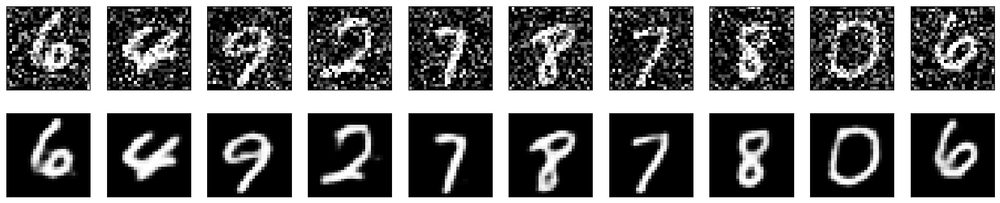

This project demonstrates how to use a simple Autoencoder to remove noise from images — illustrated with the MNIST dataset (handwritten digits).

What’s inside:
- Building an Autoencoder in Python with TensorFlow/Keras
- Generating noisy versions of images
- Visualizing original, noisy, and reconstructed images
